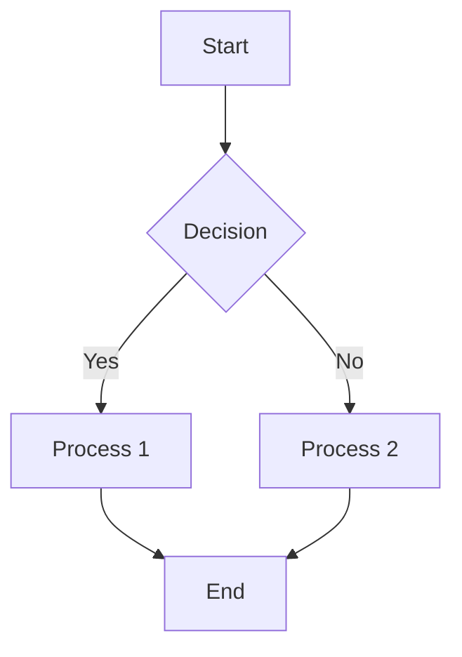

# Notescapes Demo Document

Welcome to Notescapes! This document showcases various features of our Obsidian-like editor.

## Basic Formatting

You can make text **bold** using double asterisks and _italic_ using underscores. You can also mark text as ~~strikethrough~~ using double tildes and ==highlight important information== using double equals signs.

For code, use `backticks` for inline code or create code blocks:

```javascript
// This is a JavaScript code block
function greet(name) {
  return `Hello, ${name}!`;
}
```

## Lists

### Unordered Lists

- First item
- Second item
  - Nested item 1
  - Nested item 2
- Third item

### Ordered Lists

1. First step
2. Second step
   1. Sub-step A
   2. Sub-step B
3. Third step

### Task Lists

- [ ] Pending task
- [x] Completed task
- [ ] Another pending task

## Links and References

[External Link](https://example.com)
[[Internal Link to Another Note]]

## Quotes and Callouts

> This is a blockquote. It can contain multiple paragraphs.
>
> Like this one.

> [!NOTE]
> This is a note callout that contains important information.

> [!WARNING]
> Be careful about this warning.

> [!TIP]
> Here's a helpful tip for using Notescapes.

## Tables

| Column 1  | Column 2  | Column 3  |
| --------- | --------- | --------- |
| Data 1    | Data 2    | Data 3    |
| More data | More data | More data |
| Last row  | Last row  | Last row  |

## HTML Integration

<div style="background-color: #f0fff0; padding: 10px; border-radius: 5px; margin: 20px 0;">
  <h3>HTML Component</h3>
  <p>This is an HTML block with custom styling.</p>
  <ul>
    <li>Item one</li>
    <li>Item two</li>
  </ul>
</div>

## Mathematical Expressions

Inline math: $E = mc^2$

Block math:

$$
\frac{1}{\Bigl(\sqrt{\phi \sqrt{5}}-\phi\Bigr) e^{\frac25 \pi}} = 1+\frac{e^{-2\pi}} {1+\frac{e^{-4\pi}} {1+\frac{e^{-6\pi}} {1+\frac{e^{-8\pi}} {1+\ldots} } } }
$$

## Images


## Footnotes

This is a sentence with a footnote[^1].

[^1]: This is the footnote content.

## Horizontal Rule

Above this line is regular text.

---

Below that line is more text.

## Combining Various Elements

> Here's a quote that contains **bold text**, _italic text_, and `inline code`.
>
> - It also has a list
> - With multiple items
>
> And a code block:
>
> ```python
> print("Hello from a code block in a quote!")
> ```

## Special Characters & Escaping

\*\*This is not bold\*\* because the asterisks are escaped.

&copy; 2023 Notescapes - Using HTML entity for copyright symbol.

## Embedding Content

You can embed files, like PDFs or other notes:

![[example.pdf]]

## Audio Recording

[Audio Recording from 2023-09-25]

## Diagram Example



## Daily Notes Section

### Today's Tasks

- [ ] Morning review
- [ ] Team meeting at 2 PM
- [ ] Complete project milestone

### Notes

Met with Alice to discuss upcoming project timeline. Key points:

1. Launch scheduled for November 15
2. Budget approved for additional resources
3. Need to finalize design by end of week

## Mobile Editing Test

This paragraph is for testing editing on mobile devices, with special attention to touch interactions, selection handles, and keyboard behavior.

## Final Notes

This document demonstrates the various formatting and features available in Notescapes. Feel free to use it as a reference when creating your own notes!
